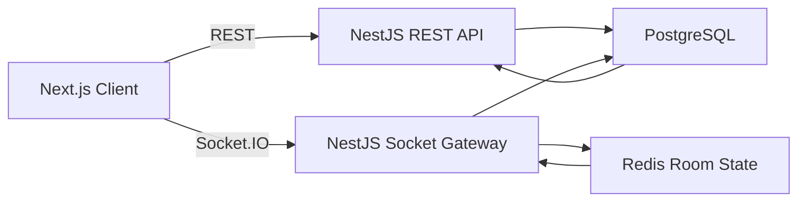
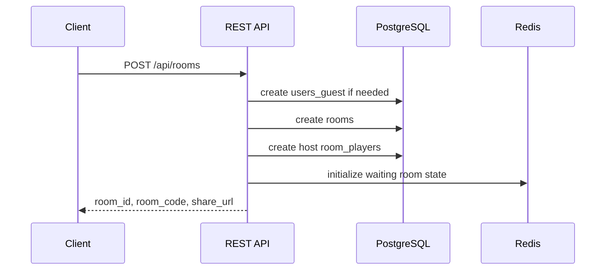
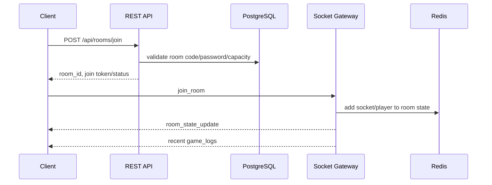

# Architecture

Project: MariTycoon  
Source of truth: `docs/01. prd.md`

## 1. Ringkasan

MariTycoon adalah aplikasi Monopoli Indonesia multiplayer real-time berbasis room. Pengguna bermain sebagai guest tanpa login, host membuat room, pemain bergabung lewat link atau room code, lalu game berjalan dengan state terpisah per room.

Arsitektur MVP mengikuti PRD:

- Frontend: Next.js, TypeScript, TailwindCSS, Zustand, Socket.IO Client
- Backend: Node.js, NestJS, Socket.IO
- State realtime: Redis
- Database persisten: PostgreSQL
- Deployment: Docker, Nginx, VPS

## 2. Prinsip Arsitektur

1. Server authoritative untuk semua aksi game.
   Client hanya mengirim intent seperti `roll_dice`, `buy_property`, atau `end_turn`. Backend memvalidasi, mengubah state, menyimpan log, lalu broadcast hasil.

2. Room isolation.
   Setiap room memiliki state dan Socket.IO room sendiri. Aksi di Room A tidak boleh mempengaruhi Room B.

3. Redis untuk state aktif, PostgreSQL untuk data persisten.
   Redis menyimpan state game berjalan agar update cepat. PostgreSQL menyimpan room, player, properti master, snapshot penting, dan game logs.

4. Guest-first.
   Karena MVP tidak butuh login, identitas guest harus tetap bisa reconnect selama sesi aktif melalui `user_id` guest dan token sesi.

5. Event-driven gameplay.
   Perubahan game diterbitkan sebagai event Socket.IO dan dicatat sebagai `game_logs` untuk reconnect history, audit, dan debugging.

## 3. High-Level System

## 4. Frontend Boundaries

Frontend bertanggung jawab untuk:

- Routing halaman publik dan game.
- Form create room dan join room.
- Rendering board, player list, action panel, chat, modal, dan game log.
- Menyimpan UI state lokal dengan Zustand.
- Mengirim intent pemain melalui REST atau Socket.IO.
- Menampilkan state terbaru dari `room_state_update` dan event turunan.

Frontend tidak boleh:

- Mengacak dadu secara final.
- Menghitung rent final secara trusted.
- Mengubah ownership, uang, posisi, atau status player tanpa konfirmasi server.
- Menentukan winner secara mandiri.

## 5. Backend Boundaries

Backend REST bertanggung jawab untuk:

- Membuat room.
- Menampilkan public lobby.
- Validasi join via room code dan password.
- Membuat atau mengambil guest session.

Backend Socket.IO bertanggung jawab untuk:

- Join socket ke room.
- Start game.
- Turn processing.
- Dice roll.
- Movement.
- Tile event resolution.
- Property purchase, rent, jail, bankruptcy, dan winner detection.
- Chat broadcast dan anti-spam.
- Reconnect dan disconnect timeout.

## 6. Data Storage Strategy

### PostgreSQL

Digunakan untuk:

- `users_guest`
- `rooms`
- `room_players`
- `properties`
- `room_properties`
- `game_logs`

PostgreSQL adalah sumber data jangka panjang untuk room dan histori. Data master properti disimpan di `properties`.

### Redis

Digunakan untuk:

- Active room state.
- Socket/session mapping.
- Reconnect timeout 5 menit.
- Turn timer.
- Rate limit chat dan room creation.
- Optional distributed lock per room.

Key awal yang disarankan:

- `room:{roomId}:state`
- `room:{roomId}:locks`
- `room:{roomId}:turn_timer`
- `session:{guestId}`
- `socket:{socketId}`

## 7. Request Flow

### Create Room

### Join Room

## 8. Module Breakdown

### Frontend

- `pages/routes`: `/`, `/create-room`, `/join`, `/room/:roomId`
- `components/ui`: Button, Input, Modal, Toast, Avatar, Badge, Card
- `components/game`: GameBoard, BoardTile, Dice, PlayerToken, PlayerSidebar, ActionPanel, ChatBox, GameLog
- `stores`: room store, game store, chat store, session store
- `services`: REST client, socket client

### Backend

- `RoomsModule`: create room, public lobby, join validation, room settings
- `GuestsModule`: guest identity/session
- `GameModule`: game rules, turn engine, action validation
- `SocketModule`: Socket.IO gateway and room broadcasts
- `ChatModule`: chat validation, broadcast, rate limit
- `PropertiesModule`: property master data and room property state
- `PersistenceModule`: snapshot, logs, recovery

## 9. Security and Reliability

- Hash room password before saving.
- Rate limit create room, join room, chat, and game actions.
- Validate every Socket.IO event against current player, room status, and turn state.
- Reject duplicate/out-of-turn actions.
- Keep disconnect slot for 5 minutes.
- Persist game logs for recovery and reconnect context.
- Use server-side dice generation only.

## 10. Known Requirement Risks

- Invite-only room is listed in PRD but not represented in API/database yet.
- Spectator is optional but no room capacity, permissions, or Socket.IO event model exists.
- Trade UI is listed in design/components, while PRD places trading under future features. MVP should exclude trade unless requirement changes.
- Auction is part of standard Monopoli flow but game rules mark it optional for MVP. Product decision needed.
- Turn timer is listed in create room, but API/database documents do not define `turn_timer`.
- Reconnect says data remains stored for 5 minutes, but guest session token mechanics are not specified.
