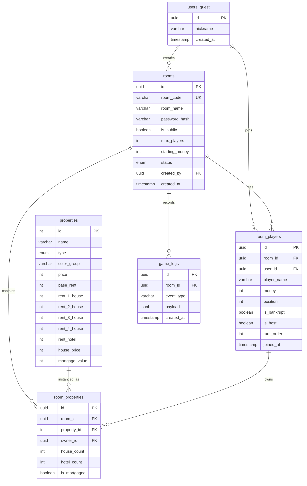

# ERD

Project: MariTycoon  
Source of truth: `docs/01. prd.md`, `docs/05. database.md`

## 1. Scope

ERD ini mendukung MVP MariTycoon:

- Guest user tanpa login.
- Room public/private dengan password optional.
- Room player dan host.
- Data master properti papan.
- Ownership properti per room.
- Game logs untuk realtime history dan reconnect.

## 2. Entity Relationship Diagram

## 3. Table Details

### `users_guest`

Menyimpan identitas sementara pemain.

| Field | Type | Constraint |
| --- | --- | --- |
| `id` | UUID | Primary key |
| `nickname` | VARCHAR(50) | Not null |
| `created_at` | TIMESTAMP | Default now |

Catatan: Untuk reconnect yang kuat, implementasi perlu session token di luar skema saat ini atau tabel tambahan.

### `rooms`

Menyimpan konfigurasi room.

| Field | Type | Constraint |
| --- | --- | --- |
| `id` | UUID | Primary key |
| `room_code` | VARCHAR(10) | Unique, not null |
| `room_name` | VARCHAR(100) | Not null |
| `password_hash` | VARCHAR(255) | Nullable |
| `is_public` | BOOLEAN | Default true |
| `max_players` | INT | Default 4, range 2-8 |
| `starting_money` | INT | Default 15000000 |
| `status` | ENUM | `waiting`, `playing`, `finished` |
| `created_by` | UUID | FK `users_guest.id` |
| `created_at` | TIMESTAMP | Default now |

Recommended constraints:

- Unique index on `room_code`.
- Check `max_players between 2 and 8`.
- Check `starting_money > 0`.

### `room_players`

Menyimpan player dalam room.

| Field | Type | Constraint |
| --- | --- | --- |
| `id` | UUID | Primary key |
| `room_id` | UUID | FK `rooms.id` |
| `user_id` | UUID | FK `users_guest.id` |
| `player_name` | VARCHAR(50) | Not null |
| `money` | INT | Default 0 |
| `position` | INT | Default 0 |
| `is_bankrupt` | BOOLEAN | Default false |
| `is_host` | BOOLEAN | Default false |
| `turn_order` | INT | Nullable before game starts |
| `joined_at` | TIMESTAMP | Default now |

Recommended constraints:

- Unique `(room_id, user_id)` for active participation.
- Unique `(room_id, turn_order)` where `turn_order is not null`.
- Check `position between 0 and 39`.

### `properties`

Data master papan Monopoli Indonesia.

| Field | Type | Constraint |
| --- | --- | --- |
| `id` | INT | Primary key, board index |
| `name` | VARCHAR(100) | Not null |
| `type` | ENUM | city/station/utility/tax/chance/community_chest/start/jail/parking |
| `color_group` | VARCHAR(20) | Nullable |
| `price` | INT | Nullable |
| `base_rent` | INT | Nullable |
| `rent_1_house` | INT | Nullable |
| `rent_2_house` | INT | Nullable |
| `rent_3_house` | INT | Nullable |
| `rent_4_house` | INT | Nullable |
| `rent_hotel` | INT | Nullable |
| `house_price` | INT | Nullable |
| `mortgage_value` | INT | Nullable |

Recommended constraints:

- Board tile id should cover 0-39 if using position as tile index.
- Buyable properties must have `price`, `base_rent`, and `mortgage_value`.
- Non-buyable tiles should keep price/rent nullable.

### `room_properties`

Status properti per room.

| Field | Type | Constraint |
| --- | --- | --- |
| `id` | UUID | Primary key |
| `room_id` | UUID | FK `rooms.id` |
| `property_id` | INT | FK `properties.id` |
| `owner_id` | UUID | Nullable FK `room_players.id` |
| `house_count` | INT | Default 0 |
| `hotel_count` | INT | Default 0 |
| `is_mortgaged` | BOOLEAN | Default false |

Recommended constraints:

- Unique `(room_id, property_id)`.
- Check `house_count between 0 and 4`.
- Check `hotel_count in (0, 1)`.
- If `hotel_count = 1`, `house_count` should be `0` or treated consistently by rules engine.

### `game_logs`

Histori event untuk reconnect dan game log UI.

| Field | Type | Constraint |
| --- | --- | --- |
| `id` | UUID | Primary key |
| `room_id` | UUID | FK `rooms.id` |
| `event_type` | VARCHAR(50) | Not null |
| `payload` | JSONB | Not null |
| `created_at` | TIMESTAMP | Default now |

Recommended indexes:

- `(room_id, created_at)`
- `(room_id, event_type)`

## 4. Missing Fields From PRD

Field berikut dibutuhkan oleh PRD tetapi belum ada di database design awal:

| Requirement | Current Gap | Recommendation |
| --- | --- | --- |
| Turn Timer | Create room input menyebut `Turn Timer`, tabel `rooms` belum punya field | Tambahkan `turn_timer_seconds` |
| Share URL | Output create room menyebut share URL | Bisa dihitung dari `room_code` atau disimpan sebagai derived value |
| Private Invite Only | PRD menyebut invite-only | Butuh `visibility` enum dan invite token/member allowlist |
| Reconnect Timeout | Timeout 5 menit | Butuh session token dan disconnect deadline di Redis atau DB |
| Ready Status | Waiting room butuh ready toggle | Butuh `is_ready` pada `room_players` atau Redis waiting state |
| Spectator | Role spectator optional | Butuh role field atau tabel `room_spectators` bila masuk scope |
| Jail State | Rules membutuhkan jail turns/cards | Simpan di Redis game state; snapshot DB optional |
| Chance/Chest Cards | Rules membutuhkan deck dan kartu bebas penjara | Simpan deck state di Redis; master card table optional |
