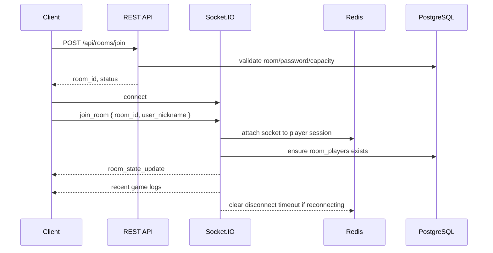
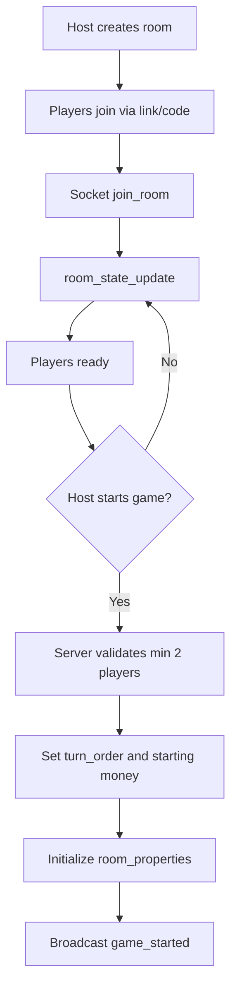
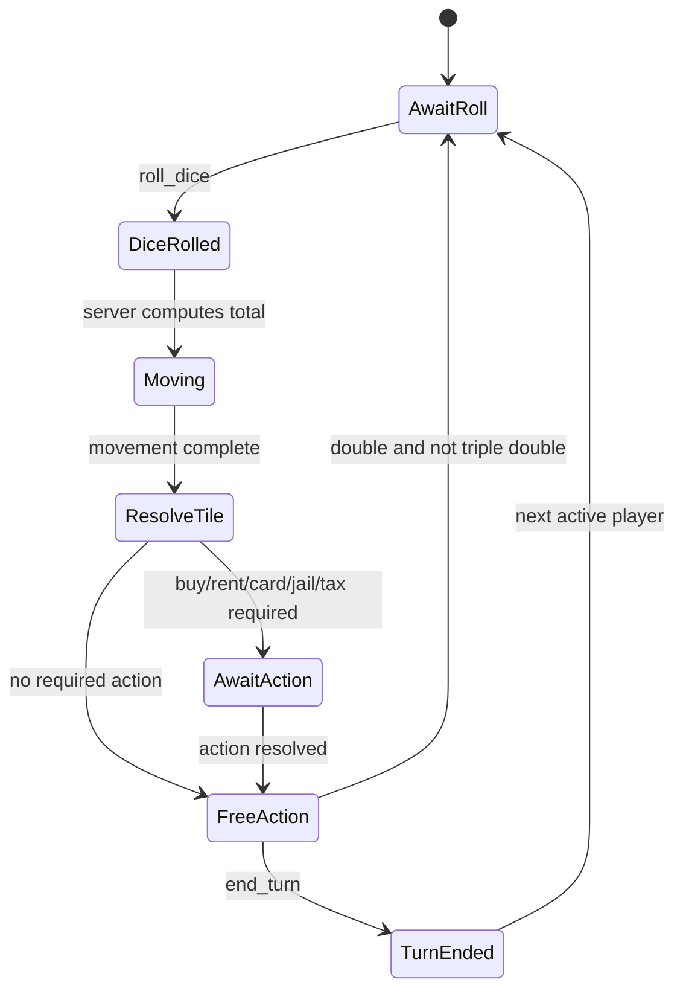
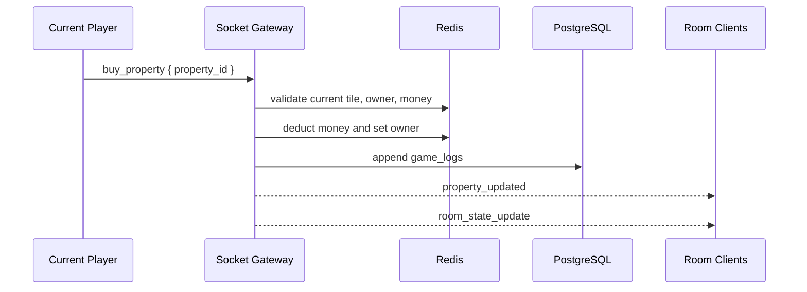
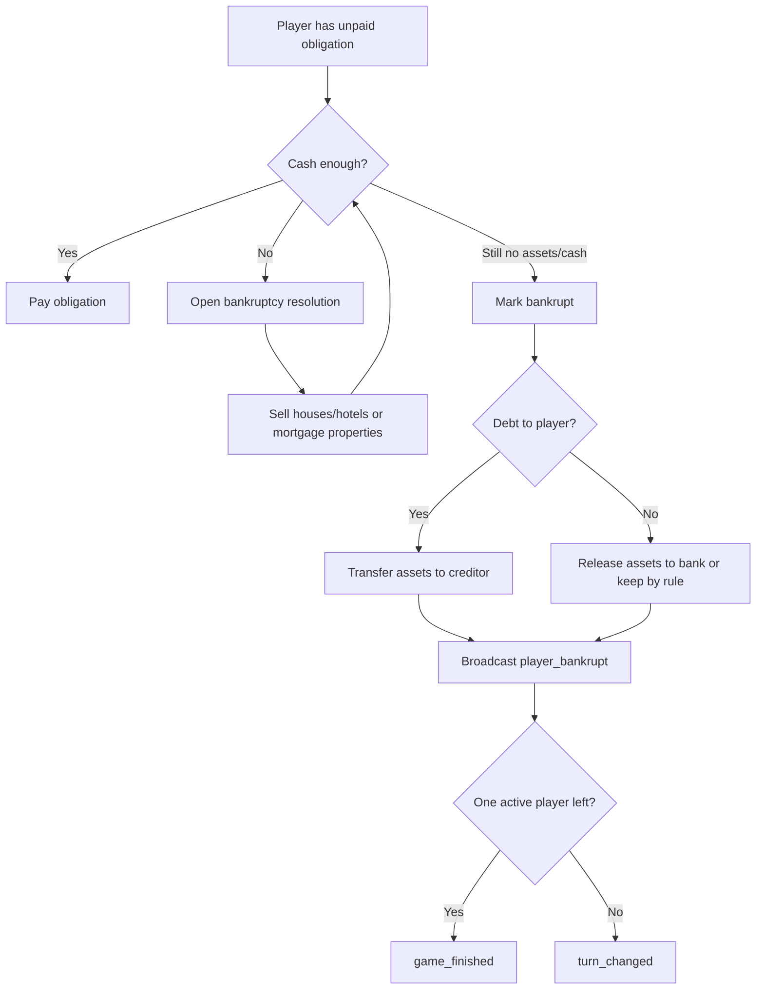

# Realtime Flow

Project: MariTycoon  
Source of truth: `docs/01. prd.md`, `docs/06. api-spec.md`, `docs/07. game-rules.md`

## 1. Tujuan

Realtime flow memastikan semua pemain dalam room melihat state yang sama untuk:

- Player join/left/reconnect.
- Start game.
- Dice roll dan movement.
- Property purchase.
- Rent payment.
- Jail.
- Bankruptcy.
- Chat.
- Winner detection.

Semua perubahan game harus diproses server terlebih dahulu, lalu dikirim ke client.

## 2. Transport

- REST API digunakan untuk create room, public lobby, dan join validation.
- Socket.IO digunakan untuk waiting room dan in-game actions.
- Socket.IO room name disarankan: `room:{roomId}`.

## 3. Connection Lifecycle

## 4. Core Events

### Client to Server

| Event | Allowed State | Actor | Purpose |
| --- | --- | --- | --- |
| `join_room` | waiting/playing | Guest/player | Join socket room and receive state |
| `chat_message` | waiting/playing | Player | Send chat |
| `start_game` | waiting | Host | Start game |
| `roll_dice` | playing | Current player | Roll two dice |
| `buy_property` | playing/action_required | Current player | Buy current unowned property |
| `build_house` | playing/free_action | Owner | Build house/hotel |
| `end_turn` | playing | Current player | End current turn |
| `pay_rent` | playing/action_required | Current player | Pay rent if required |

### Server to Client

| Event | Purpose |
| --- | --- |
| `room_state_update` | Full or partial authoritative room state |
| `game_started` | Game status moved to playing |
| `chat_broadcast` | User/system chat |
| `dice_rolled_result` | Dice result from server |
| `player_moved` | Player position changed |
| `action_required` | Current player must resolve action |
| `property_updated` | Ownership/building/mortgage changed |
| `turn_changed` | Active player changed |
| `player_bankrupt` | Player eliminated |
| `game_finished` | Winner and leaderboard |

## 5. Waiting Room Flow

Note: Ready status is described in sitemap but not in API/database. It should be represented in waiting room state before implementation.

## 6. Turn Flow

## 7. Dice and Double Flow

Rules from PRD/game rules:

- Two dice.
- Total range 2-12.
- Double gives extra turn.
- Three consecutive doubles in one turn sends player to jail.

Server flow:

1. Validate current player and status `playing`.
2. Generate `dice_1` and `dice_2`.
3. Increment `double_count_this_turn` if double, otherwise reset to 0.
4. If double count reaches 3, move player to jail and require turn end.
5. Otherwise move player by total.
6. Resolve landed tile.
7. Broadcast dice and movement events.

## 8. Property and Rent Flow

### Buy Property

### Pay Rent

1. Server detects landed tile owned by another active player.
2. If property is mortgaged, no rent is charged.
3. Server calculates rent from building state.
4. If payer has enough money, transfer money immediately.
5. If not enough, enter debt/bankruptcy resolution.

## 9. Bankruptcy Flow

## 10. Reconnect Flow

PRD requirement:

- Data tetap tersimpan.
- Slot pemain tetap ada.
- Bisa reconnect.
- Timeout 5 menit.

Recommended flow:

1. On disconnect, mark player as disconnected in Redis with deadline `now + 5 minutes`.
2. Keep `room_players` row and turn slot.
3. Broadcast player disconnected status.
4. If reconnect before deadline, reattach socket and broadcast active status.
5. If deadline passes, mark player left or auto-bankrupt depending final product rule.

Open decision: PRD does not define whether a disconnected player during their turn should auto-skip, pause timer, or continue countdown.

## 11. Ordering and Consistency

To avoid race conditions:

- Process one game action per room at a time.
- Use Redis lock or an in-process queue keyed by `roomId`.
- Include a monotonically increasing `state_version` in room state.
- Client should ignore stale events with older `state_version`.
- Game logs should be appended after successful state mutation.

## 12. Requirement Issues Before Coding

- `pay_rent` exists as client event, but rent is described as automatic in PRD. Prefer server automatic rent after movement, with `action_required` only for bankruptcy/debt.
- Turn timer is listed in create room, but no event exists for timeout.
- Ready toggle is in sitemap but missing from API spec.
- `player_left` is in PRD event list, but API spec only describes join and disconnect implicitly.
- Auction is mentioned in PRD turn flow but optional in rules. MVP behavior should be locked before implementation.
