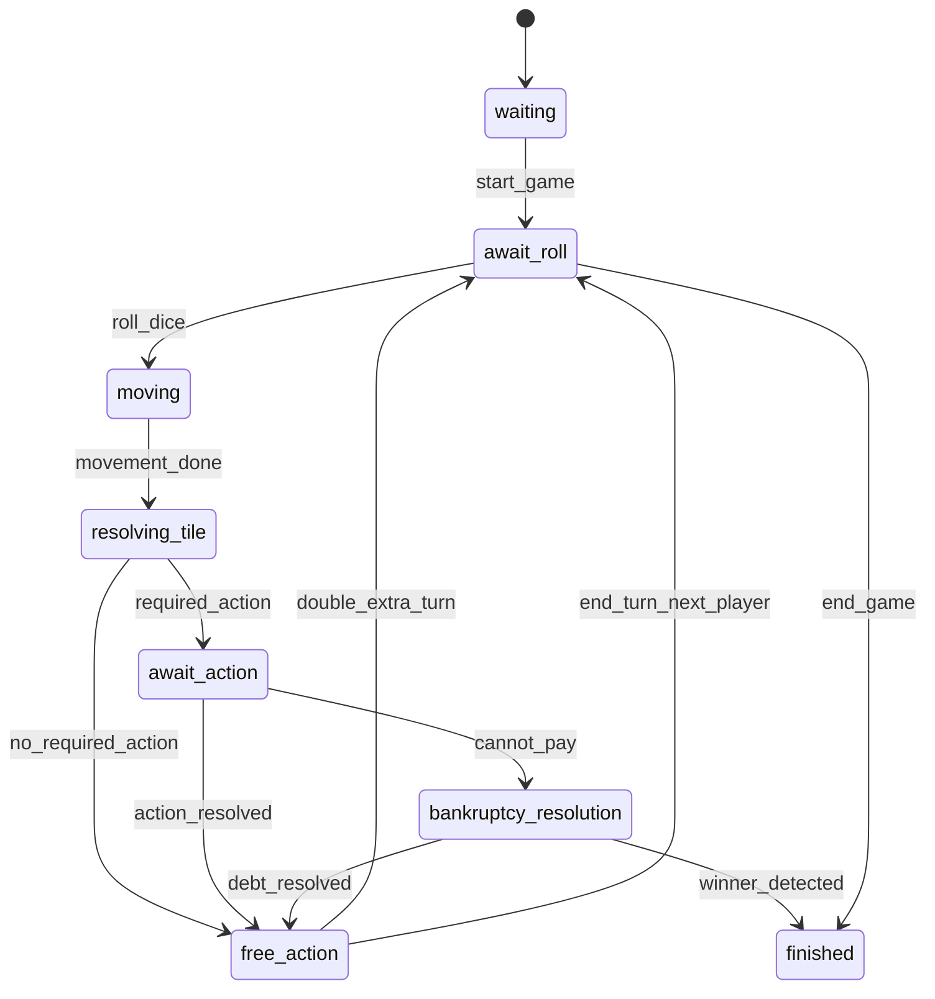

# Game State Design

Project: MariTycoon  
Source of truth: `docs/01. prd.md`, `docs/05. database.md`, `docs/07. game-rules.md`

## 1. Goal

Game state design ini menjelaskan bentuk state authoritative yang disimpan server untuk setiap room. State aktif berada di Redis agar update realtime cepat, sedangkan PostgreSQL menyimpan data persisten dan log.

## 2. State Ownership

| Data | Owner | Storage |
| --- | --- | --- |
| Room config | Backend | PostgreSQL + Redis copy |
| Active gameplay state | Backend | Redis |
| Master board/properties | Backend | PostgreSQL |
| Game logs | Backend | PostgreSQL |
| UI local state | Frontend | Zustand |
| Dice result | Backend | Redis/log |

Client tidak boleh menjadi source of truth untuk uang, posisi, ownership, atau giliran.

## 3. Room State Shape

Konsep state per room:

```text
RoomGameState
- room_id
- room_code
- status
- config
- state_version
- players
- properties
- turn
- dice
- decks
- pending_action
- logs_cursor
- timestamps
```

### `config`

```text
config
- max_players
- starting_money
- turn_timer_seconds
- start_bonus
- jail_fine
- visibility
- has_password
```

Note: `turn_timer_seconds` belum ada di database design awal, tetapi muncul sebagai input PRD.

### `players`

```text
players[player_id]
- player_id
- user_id
- name
- role: host | player | spectator
- money
- position
- turn_order
- is_ready
- is_connected
- disconnected_at
- is_bankrupt
- is_in_jail
- jail_turns
- get_out_of_jail_cards
- double_count_this_turn
- last_action_at
```

Spectator adalah role opsional dari PRD. Jika tidak masuk MVP, role cukup `host | player`.

### `properties`

```text
properties[property_id]
- property_id
- owner_id
- house_count
- hotel_count
- is_mortgaged
```

Detail harga dan rent tidak perlu diduplikasi penuh di Redis jika bisa dibaca dari master `properties`. Namun cache read-only boleh digunakan untuk performa.

### `turn`

```text
turn
- current_player_id
- current_turn_order
- phase
- started_at
- deadline_at
- required_action_id
```

Recommended `phase`:

- `waiting`
- `await_roll`
- `moving`
- `resolving_tile`
- `await_action`
- `free_action`
- `bankruptcy_resolution`
- `finished`

### `dice`

```text
dice
- dice_1
- dice_2
- total
- is_double
- rolled_at
```

### `decks`

```text
decks
- chance_draw_pile
- chance_discard_pile
- community_draw_pile
- community_discard_pile
```

PRD membutuhkan Chance dan Community Chest, tetapi belum ada master card schema. Untuk MVP awal, deck dapat didefinisikan sebagai config static di backend dan state urutan kartu disimpan di Redis.

### `pending_action`

```text
pending_action
- id
- type
- player_id
- data
- created_at
- expires_at
```

Possible types:

- `buy_property`
- `pay_tax`
- `draw_chance`
- `draw_community_chest`
- `jail_decision`
- `bankruptcy_resolution`
- `end_turn`

## 4. State Versioning

Setiap perubahan authoritative menaikkan `state_version`.

Contoh:

1. Player roll dice: version 10 -> 11.
2. Player moved: version 11 -> 12.
3. Rent paid: version 12 -> 13.

Client sebaiknya menyimpan version terakhir dan mengabaikan event lama. Ini penting ketika jaringan lambat atau reconnect.

## 5. Action Validation

Setiap Socket.IO action harus melewati validasi:

- Room exists.
- Player exists in room.
- Player not bankrupt.
- Game status sesuai.
- Actor adalah current player jika action turn-based.
- Action sesuai `phase`.
- Pending action cocok bila action merespons prompt.
- Uang cukup, property valid, ownership valid.
- Tidak ada double-submit untuk action yang sama.

## 6. Turn State Machine



## 7. Persistence Strategy

### On Room Created

- Insert `rooms`.
- Insert host into `room_players`.
- Initialize Redis room state.

### On Game Started

- Assign `turn_order`.
- Set player money to `starting_money`.
- Initialize `room_properties` for each buyable property.
- Store initial Redis state.
- Append `game_started` log.

### During Game

Persist after important events:

- Dice rolled.
- Player moved.
- Property bought/sold/mortgaged/unmortgaged.
- Rent paid.
- Jail status changed.
- Player bankrupt.
- Game finished.

For performance, Redis is updated first inside room lock, then PostgreSQL logs/snapshots are written. If DB write fails, event should be retried or room marked needing recovery.

### Reconnect

Reconnect should load:

- Current Redis state if active.
- Recent `game_logs`.
- If Redis state missing, rebuild from latest snapshot plus logs if snapshot support exists.

## 8. Board and Properties

The board uses 40 positions (`0-39`) based on database notes. Position `0` is START.

Design document lists Indonesian property groups:

- Brown: Serang, Cilegon
- Light Blue: Bogor, Depok, Bekasi
- Pink: Bandung, Tasikmalaya, Cirebon
- Orange: Semarang, Solo, Yogyakarta
- Red: Surabaya, Malang, Kediri
- Yellow: Denpasar, Mataram, Kupang
- Green: Balikpapan, Samarinda, Banjarmasin
- Dark Blue: Jakarta, Batam

Open decision: stations, utilities, tax tile values, jail tile indexes, chance/community chest tile indexes, and go-to-jail tile index are not yet defined.

## 9. Bankruptcy State

Bankruptcy should pause normal turn progression with `phase = bankruptcy_resolution`.

Minimum state needed:

```text
debt
- debtor_id
- creditor_id nullable
- amount
- reason
```

Resolution options:

- Sell houses/hotels.
- Mortgage properties.
- Pay obligation.
- Declare bankrupt.

If bankrupt to another player, assets transfer to creditor. If bankrupt to bank, final handling needs product decision.

## 10. MVP State Exclusions

The following should stay out of MVP state unless product scope changes:

- Ranking.
- Friend list.
- Achievement.
- Voice chat.
- AI bot.
- Marketplace.
- Clan/guild.
- Custom map builder.
- Trading system.

Trade appears in design/components, but PRD places trading in a future phase. Treat trade UI as future work.

## 11. Requirement Issues Before Coding

- No explicit `turn_timer_seconds` field despite turn timer being part of create room.
- Ready status appears in sitemap but not in database/API.
- Invite-only visibility is required by PRD but absent from schema.
- Guest reconnect needs session token design.
- Card deck contents and tile indexes are not specified.
- End game by host is listed as host right but missing from API spec.
- Build house/hotel requires color-set validation, but property group data must be complete and seeded first.
