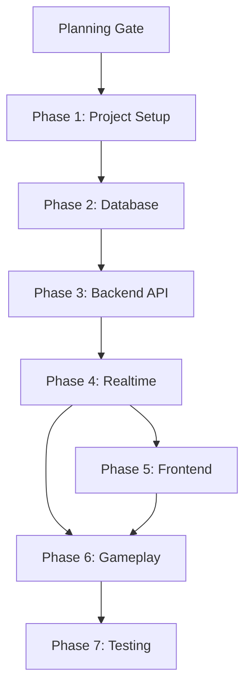
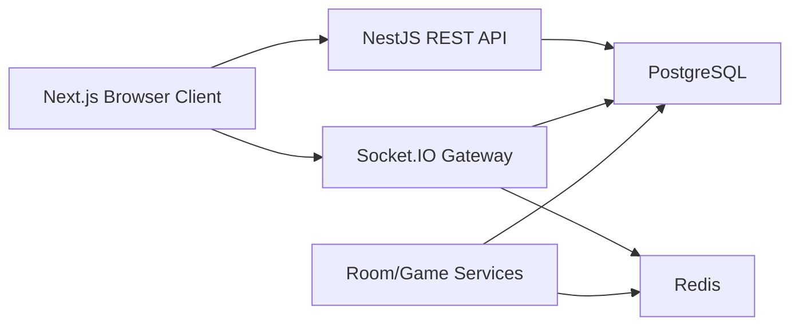
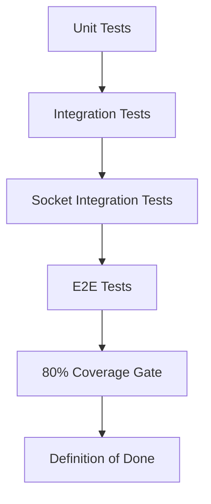

# Dependency Map

Project: MariTycoon

## 1. Phase Dependencies

## 2. Technical Dependencies

### Frontend

| Area | Depends On | Reason |
| --- | --- | --- |
| Home/public lobby | Room API | Needs public room data |
| Create room page | Room API | Needs room creation and redirect data |
| Join page | Join API | Needs code/password validation |
| Waiting room | Socket `join_room` and `room_state_update` | Needs realtime players/ready state |
| Game board | Board seed and room state | Needs tile metadata and player positions |
| Action panel | Socket game events | Needs authoritative action requirements |
| Chat | Socket chat events | Needs room-scoped realtime messages |
| Winner modal | `game_finished` event | Needs backend winner detection |

### Backend

| Area | Depends On | Reason |
| --- | --- | --- |
| Room API | Database schema | Rooms and players must persist |
| Password room | Hashing dependency and validation | Security requirement |
| Public lobby | Room/player repositories | Needs counts and status |
| Socket gateway | Guest/room/player services | Must validate player identity and room access |
| Reconnect | Redis and guest session | Needs session persistence and timeout |
| Game engine | Board seed and Redis state | Needs full tile/property data |
| Rent service | Property ownership and building state | Needs room_properties |
| Bankruptcy | Rent/debt and asset state | Needs property/mortgage/sell rules |
| Winner detection | Bankruptcy/player status | Needs active player count |

### Database

| Table | Depends On | Notes |
| --- | --- | --- |
| `users_guest` | none | Base identity table |
| `rooms` | `users_guest` | `created_by` references guest |
| `room_players` | `rooms`, `users_guest` | Player slot per room |
| `properties` | none | Static master board data |
| `room_properties` | `rooms`, `properties`, `room_players` | Ownership per room |
| `game_logs` | `rooms` | Event history |

## 3. Runtime Dependency Map

## 4. Event Dependencies

| Event | Requires | Produces |
| --- | --- | --- |
| `join_room` | valid room, guest nickname/session | player joined, room state |
| `chat_message` | joined player, rate limit pass | chat broadcast, optional log |
| `start_game` | host, room waiting, min 2 players | game started, initial turn |
| `roll_dice` | current player, phase await roll | dice result, movement, tile resolution |
| `buy_property` | pending buy action, enough money | property updated, room state |
| `build_house` | owner, full color set, even build rule | property updated |
| `pay_rent` | rent obligation | money transfer or bankruptcy |
| `end_turn` | current player, required actions resolved | next turn |

## 5. Test Dependencies

## 6. External Dependencies

| Dependency | Purpose |
| --- | --- |
| PostgreSQL | Persistent data and logs |
| Redis | Active game state, reconnect, timers, rate limits |
| Socket.IO | Realtime multiplayer |
| Docker | Local/deployment environment |
| Nginx | Deployment reverse proxy |

## 7. Blocker Dependencies

These decisions can block or alter implementation:

- Invite-only room model before private room finalization.
- Turn timer behavior before realtime/game turn implementation.
- Full 40-tile board seed before gameplay.
- Chance and Community Chest deck before special tile implementation.
- Ready state before waiting room completion.
- Auction decision before property purchase flow.
- Spectator decision before room capacity and socket permissions.
